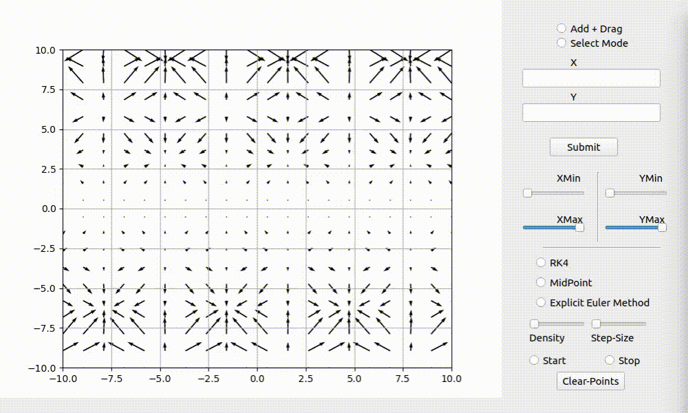

# Interactive Integration Techniques under Vector Fields

A project to visualize the motion of particles under a velocity vector fields. Right now, we support 3 different vector fields.

## Requirements 

+ matplotlib
+ PyQt5
+ numpy

## Execution and Working

+ The code functions in two modes (Add mode) and (Select Mode). Add mode adds new points and allows dragging of points across the plot and select mode assigns solvers to each point. We have 3 options to choose from. (RK4, Explicit Euler and Midpoint method). The colors assigned to each point represent the solver it contains. There is a slider for changing the step size of this method. 

+ You can change the density of points and Step size for each of the animations. There is also additional functionality to adjust the X and Y limits of the axes. 

+ You can also enter your own custom vector field in the plot. Please be sure to use python syntax while entering the formula. for examples,  {u = X**2*cos(X) + Y**2*cos(Y)} and {v = Y**2*cos(Y)}

+ There is a functionality at to clear the points entered by the user. 

